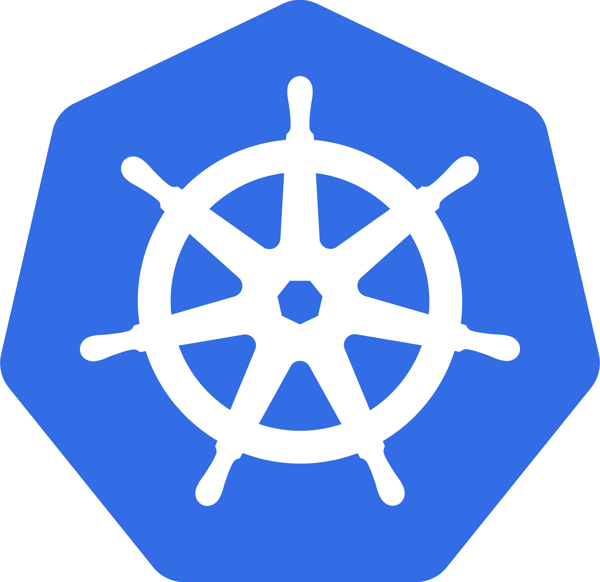

# 🚀 **Learn Certified Kubernetes Administrator (CKA) from Scratch**


---

<h3 align="center">📌 Master Kubernetes – From Beginner to CKA Certified! 🎯</h3>  

<div align="center">
  <a href="https://github.com/NotHarshhaa/Certified_Kubernetes_Administrator">
    
    
    
    
    
  </a>
</div>  

<p align="center">
  A complete roadmap to learning Kubernetes and passing the Certified Kubernetes Administrator (CKA) exam with confidence.  
  <br><br>
  <a href="https://github.com/NotHarshhaa/Certified_Kubernetes_Administrator/issues"><b>📢 Report an Issue</b></a> •  
  <a href="https://github.com/NotHarshhaa/Certified_Kubernetes_Administrator/issues"><b>💡 Request a Feature</b></a>
</p>  

---

[](https://kubernetes.io/)  [](https://helm.sh/)  [](https://prometheus.io/)  [](https://aws.amazon.com/eks/) [](#-contributing)  

**Master Kubernetes from scratch and become a Certified Kubernetes Administrator (CKA)!**  
This repository is your **one-stop resource** to learn **Kubernetes, Helm, Operators, Prometheus, and AWS EKS** with hands-on examples.  

> [!NOTE]
>
> 🚀 Whether you're preparing for the CKA exam or want to gain real-world Kubernetes expertise, this guide will help you achieve your goals!  

---

## 📂 Project Structure  

This repository is **well-structured** for easy navigation. Each section contains **detailed guides, examples, and hands-on exercises** to help you learn.  

📁 **Certified_Kubernetes_Administrator/**  

- 📦 **CKA/** → [📖 Kubernetes Learning Path](CKA/README.md)  
- 📦 **Helm/** → [📖 Helm Guide](Helm/README.md)  
- 📦 **Operators/** → [📖 Kubernetes Operators](Operators/README.md)  
- 📦 **Prometheus/** → [📖 Kubernetes Monitoring with Prometheus](Prometheus/README.md)  
- 📦 **EKS/** → [📖 AWS EKS Tutorial](EKS/README.md)  
- 📜 **LICENSE** → MIT License  
- 📜 **README.md** → *You're here!*  

---

## 🎯 Why Use This Repository?  

✔ **Comprehensive**: Covers all Kubernetes concepts from basics to advanced topics.  
✔ **Hands-on Learning**: Includes **practical examples, real-world use cases, and exercises**.  
✔ **Exam-Oriented**: Helps you prepare and pass the **CKA Exam** with confidence.  
✔ **Easy Navigation**: Well-structured sections for each topic.  
✔ **Always Updated**: Continuously improved based on feedback and latest trends.  

---

## 🚀 **Why Choose This Guide?**  

This repository is your one-stop solution to **becoming a Kubernetes expert** and preparing for the **Certified Kubernetes Administrator (CKA) exam**. Whether you're a beginner or have some experience with Kubernetes, this guide will take you from the basics to **advanced Kubernetes concepts**.  

### 📌 **What’s Inside?**  

✅ **Zero to Expert** – Learn from scratch with structured content  
✅ **Hands-on Labs** – Real-world Kubernetes examples & best practices  
✅ **Exam Preparation** – Covers all CKA topics with tips & tricks  
✅ **Advanced Topics** – Helm, Operators, Prometheus, and AWS EKS  
✅ **Step-by-Step Setup** – Deploy & manage a Kubernetes cluster like a pro  

With this guide, you’ll **not only pass the CKA exam** but also gain deep knowledge of **real-world Kubernetes deployments**!  

---

## 📖 **Table of Contents**  

This guide is structured to help you **learn in the right order**. Follow the sequence for the best learning experience!  

| 🚀 **Index** | 📌 **Topic**     | 📚 **Tutorial** | 🔗 **Official Docs** | 📌 **Description** |
|-------------|----------------|-----------------|---------------------|--------------------|
| 1️⃣  | **Kubernetes (CKA)** | [Start Here](https://github.com/NotHarshhaa/Certified_Kubernetes_Administrator/tree/master/CKA) | [kubernetes.io](https://kubernetes.io) | Learn **Kubernetes core concepts** and become CKA certified! |
| 2️⃣  | **Helm - Package Manager**       | [Learn Helm](https://github.com/NotHarshhaa/Certified_Kubernetes_Administrator/tree/master/Helm) | [helm.sh](https://helm.sh) | Master **Kubernetes package management** with Helm 📦 |
| 3️⃣  | **Kubernetes Operators**  | [Operators Guide](https://github.com/NotHarshhaa/Certified_Kubernetes_Administrator/tree/master/Operators) | [kubernetes.io](https://kubernetes.io/docs/concepts/extend-kubernetes/operator) | Learn **custom Kubernetes extensions** with Operators ⚙️ |
| 4️⃣  | **Monitoring with Prometheus** | [Monitoring with Prometheus](https://github.com/NotHarshhaa/Certified_Kubernetes_Administrator/tree/master/Prometheus) | [prometheus.io](https://prometheus.io) | Monitor & visualize your cluster with **Prometheus & Grafana** 📊 |
| 5️⃣  | **AWS EKS**    | [Learn AWS EKS](https://github.com/NotHarshhaa/Certified_Kubernetes_Administrator/tree/master/EKS) | [AWS EKS](https://aws.amazon.com/eks) | Learn **Kubernetes on AWS** with Amazon EKS 🌐 |

---

## 📍 **Learning Roadmap**  

✅ **[Completed]**  
✔️ Hands-on Kubernetes examples & exercises  
✔️ CKA Exam-focused topics with tips  
✔️ Helm – Kubernetes Package Manager  
✔️ Operators – Extending Kubernetes API  
✔️ Prometheus – Kubernetes Monitoring  
✔️ AWS EKS – Kubernetes on AWS  

---

## 🔧 **Installation & Setup Guide**  

Follow these steps to **set up your Kubernetes environment** and start learning:  

### **1️⃣ Prerequisites**  

Before starting, ensure you have the following:  
✅ **Operating System:** Linux/macOS (Windows users can use WSL2)  
✅ **Tools Installed:** kubectl, Minikube, Docker  
✅ **Basic CLI Knowledge:** Familiarity with terminal commands  

---

### **2️⃣ Install Kubernetes CLI (kubectl)**  

`kubectl` is the command-line tool to interact with your Kubernetes cluster.  

#### 📌 **Install kubectl (Linux/macOS)**  

```sh
curl -LO "https://dl.k8s.io/release/$(curl -L -s https://dl.k8s.io/release/stable.txt)/bin/linux/amd64/kubectl"
chmod +x kubectl
sudo mv kubectl /usr/local/bin/
kubectl version --client
```  

---

### **3️⃣ Set Up a Kubernetes Cluster (Using Minikube)**  

Minikube is a lightweight Kubernetes cluster for local testing.  

#### 📌 **Install Minikube**  

```sh
curl -LO https://storage.googleapis.com/minikube/releases/latest/minikube-linux-amd64
chmod +x minikube-linux-amd64
sudo mv minikube-linux-amd64 /usr/local/bin/minikube
minikube version
```  

#### 📌 **Start Minikube Cluster**  

```sh
minikube start
kubectl get nodes
```  

---

### **4️⃣ Deploy Your First App on Kubernetes**  

Once the cluster is up, let’s deploy a simple **Nginx web server**.  

#### 📌 **Create a Deployment**  

```sh
kubectl create deployment nginx --image=nginx
```  

#### 📌 **Expose as a Service**  

```sh
kubectl expose deployment nginx --port=80 --type=NodePort
```  

#### 📌 **Check Running Pods & Services**  

```sh
kubectl get pods,svc
```  

---

## 🤝 **Contributing to This Project**  

We welcome all contributions to improve this repository! 🎉  

### **How to Contribute?**  

1️⃣ **Fork the repository**  
2️⃣ **Create a feature branch** (`git checkout -b feature/my-feature`)  
3️⃣ **Make changes & commit** (`git commit -m 'Added feature XYZ'`)  
4️⃣ **Push changes** (`git push origin feature/my-feature`)  
5️⃣ **Create a Pull Request**  

💡 **Found an issue?** Open a **[GitHub Issue](https://github.com/NotHarshhaa/Certified_Kubernetes_Administrator/issues)**  

---

## 📜 **License**  

This project is licensed under the **MIT License**. See the **[LICENSE](https://github.com/NotHarshhaa/Certified_Kubernetes_Administrator/blob/master/LICENSE)** for details.  

---

## 🌟 **Acknowledgments & Recommended Resources**  

These experts have contributed significantly to the Kubernetes ecosystem:  

🎓 **[TechWorld with Nana](https://www.techworld-with-nana.com)** – Best Kubernetes & DevOps mentor! Check out her [YouTube](https://www.youtube.com/c/TechWorldwithNana) 📺  

🎓 **[Bret Fisher](https://www.bretfisher.com)** – Great DevOps expert! Learn from his [GitHub](https://github.com/BretFisher) & [Podcast](https://www.bretfisher.com/podcast/) 🎙️  

🎓 **[Container Training](https://github.com/jpetazzo/container.training)** – Awesome Kubernetes & container training content! 📚  

---

### **Hit the Star!** ⭐

**If you find this repository helpful and plan to use it for learning, please give it a star. Your support is appreciated!**

---

### 🛠️ **Author & Community**  

This project is crafted by **[Harshhaa](https://github.com/NotHarshhaa)** 💡.  
I’d love to hear your feedback! Feel free to share your thoughts.  

---

### 📧 **Connect with me:**

[](https://linkedin.com/in/harshhaa-vardhan-reddy) [](https://github.com/NotHarshhaa)  [](https://t.me/prodevopsguy) [](https://dev.to/notharshhaa) [](https://hashnode.com/@prodevopsguy)  

---

### 📢 **Stay Connected**  


